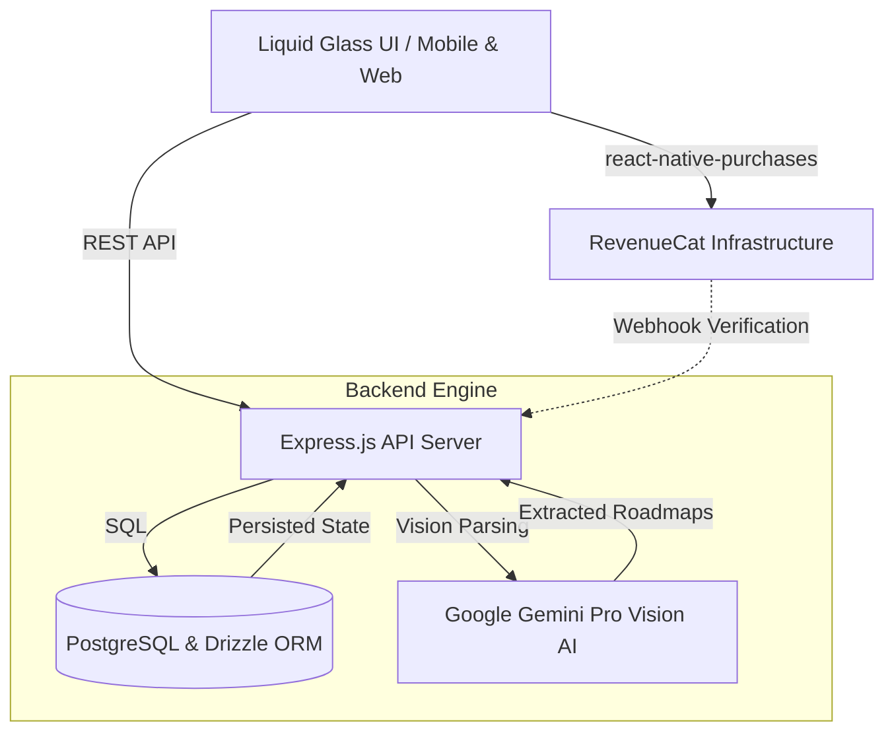
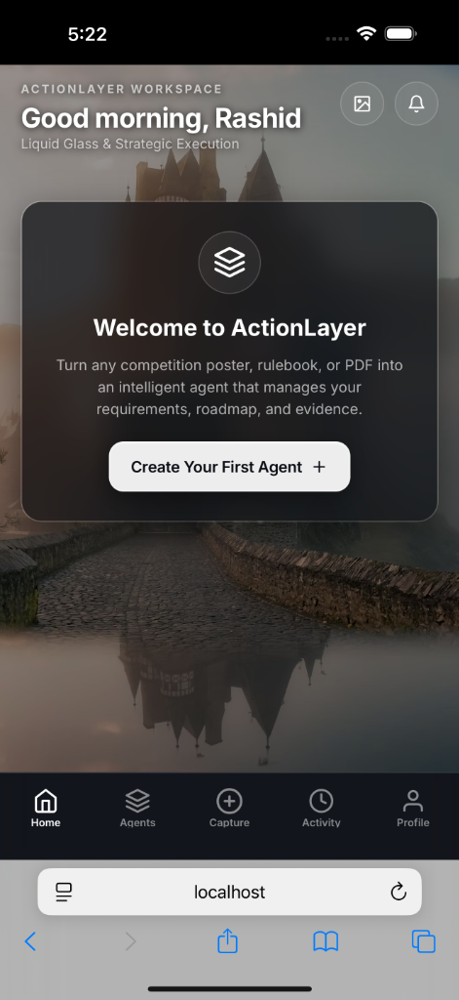
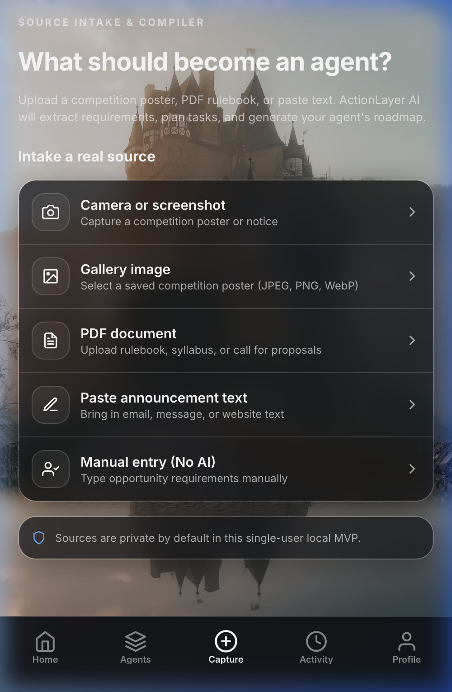
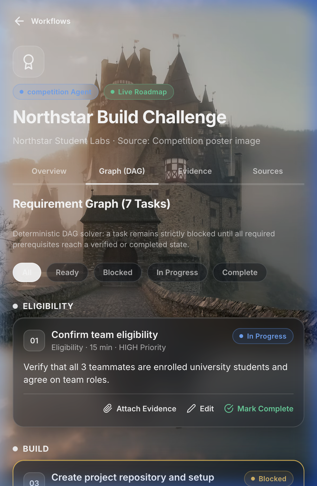
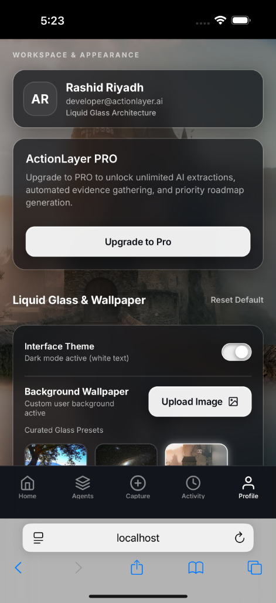

# 🚀 ActionLayer: The Universal AI Execution Engine

> A "Next Gen Award" Submission for the RevenueCat Shipaton 2026

**ActionLayer** is a beautifully crafted, AI-powered execution engine built to transform chaos into clarity. Whether you are tackling a massive hackathon, a complex university assignment, or a multi-phase freelance project, ActionLayer takes the overwhelming requirements and instantly converts them into a precise, actionable roadmap.

---

## 🌟 The Problem
Whether it's a hackathon rubric, a client brief, or a massive academic syllabus, people are constantly hit with a wall of text. It is incredibly easy to miss a crucial requirement, forget a piece of required evidence, or fail to understand the core objectives. 

## 💡 The Solution
**ActionLayer** acts as your personal AI Strategist. By simply uploading a screenshot, document, or rubric of *any* project, ActionLayer’s AI engine instantly extracts the core requirements, identifies dependencies, and builds a personalized, step-by-step execution roadmap.

### Key Features:
1. **🤖 Universal AI Extraction**: Upload a screenshot of a hackathon's Devpost page, a professor's syllabus, or a client's PDF brief. ActionLayer instantly generates a breakdown of tasks, priorities, and required evidence.
2. **✅ Smart Task Dependencies**: Tasks are automatically linked. You can't mark "Submit Project" until the "Build App" task and its required evidence are completed.
3. **💎 Liquid Glass UI**: A visually stunning, premium user interface inspired by Apple VisionOS. It features translucent glass cards, dynamic blurs, and customizable wallpapers for a relaxing, focused workspace.
4. **📈 RevenueCat PRO Integration**: ActionLayer includes a premium "PRO" tier powered by **RevenueCat**, unlocking unlimited AI extractions and priority roadmap generation.

---

## 🏗 System Architecture

ActionLayer is built on a modern, highly scalable architecture combining React Native, Expo, and a robust Node.js/PostgreSQL backend, perfectly integrated with RevenueCat and Google's Gemini AI.

---

## 📸 Application Walkthrough & Workflow

### 1. The Workspace (Home Screen)

* **What it does:** Your command center for every project. It provides a high-level overview of your active tasks, your overall progress, and urgent deadlines.
* **The Vibe:** The "Liquid Glass" design language makes task management feel less like a chore and more like a premium, focused experience.

### 2. AI Capture (Universal Extraction Engine)

* **What it does:** The core magic of the app. Upload *any* project brief, rubric, or rulebook. The Gemini AI instantly breaks down the complex rules into bite-sized, actionable tasks. 
* **Behind the scenes:** The Node.js backend processes the image, understands the context of the project, and structures the data perfectly for your roadmap.

### 3. The Roadmap (Task Management)

* **What it does:** Your newly generated tasks appear here. You can track priorities (High, Medium, Low) and see exactly what evidence (URLs, Images, Text) is required for each task before you can mark it complete.

### 4. ActionLayer PRO (RevenueCat Integration)

* **What it does:** Found in the Profile tab, the **ActionLayer PRO Paywall** allows power users to subscribe for unlimited AI extractions and advanced project management.
* **Shipaton Integration:** This was built using the `react-native-purchases` SDK, seamlessly integrating RevenueCat's subscription infrastructure directly into the sleek glass UI.

---

## 🛠 Built With

* **Frontend:** React Native, Expo, Expo Router (Web & Mobile PWA)
* **Design:** Custom "Liquid Glass" CSS, `expo-blur`, Reanimated
* **Backend:** Node.js, Express, PostgreSQL, Drizzle ORM
* **AI Engine:** Google Gemini Pro Vision 
* **Monetization:** RevenueCat (`react-native-purchases`)

---

## 🎓 Next Gen Award Qualifications
This project is officially submitted for the **Next Gen Award**.
* **Student Team:** Built by Rashid Riyadh and team, active university students.
* **Open Source:** The entire codebase is public and licensed under Apache 2.0.
* **Monetization:** Thoughtfully integrates RevenueCat for a "PRO" tier to support scalable API usage and server costs.

---
*Created with ❤️ for the RevenueCat Shipaton 2026*
